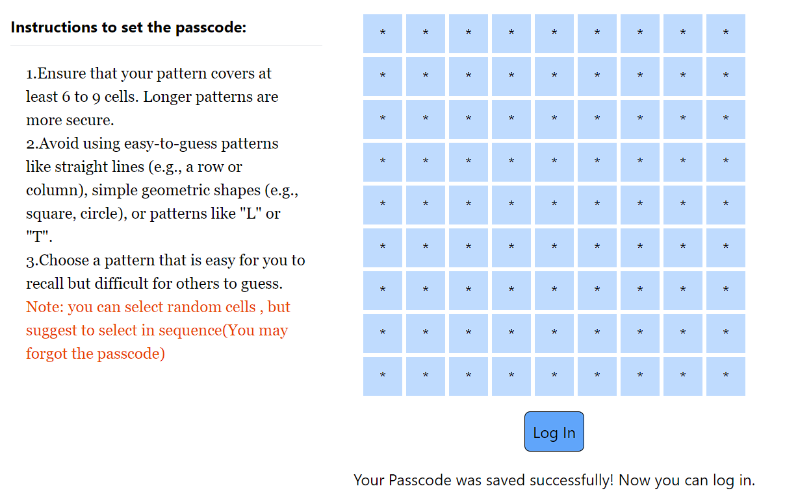

# SIMPLE PASSCODE AUTH

## Project setUp
1. clone the repo:
    git clone git@github.com:sairamkukati/passcode.git
2. navigate to root directory and run:
    npm start
3. set your passcode and confirm it. Then Login.

## Integerate into your application
    save the finalPasscode instead of password better to encrypt it before saving.
    Instead of username and password just show the passcode grid and confirm authenticity.

**Simple Passcode Authentication** is an easy-to-implement system that replaces traditional passwords with a visual passcode or pattern-based authentication. This system can enhance security and simplify user experience by removing the need to remember or manage complex passwords.

## Key Features
- **Visual and Intuitive**: Users simply create and enter a passcode or pattern by tapping or swiping, removing the need for memorizing alphanumeric passwords.
- **Strong Protection**: Passcodes, especially patterns, involve spatial memory and visual recall, making them harder to crack compared to short passwords.
- **Additional Security**: Passcodes can be used alongside other methods, such as biometrics or one-time codes, for multi-factor authentication (MFA), further enhancing security.
  
## Benefits of Passcode Auth
1. **No need to remember a password**: Traditional passwords require memorization and are often stored, which can be vulnerable to attacks. A passcode bypasses this need, simplifying user experience.
   
2. **Reduces mental load**: Users don't need to remember a combination of symbols, numbers, and letters. Passcodes are easier to recall, particularly visual patterns.
   
3. **No need for password managers**: With passcodes, users avoid the complexity of managing multiple passwords or relying on password managers to store them securely.

4. **Prevents password reuse**: A major issue with password-based systems is that users tend to reuse weak passwords across multiple platforms. Passcodes avoid this problem by enforcing simple yet unique sequences.

5. **Standardized security**: A passcode system can enforce a standardized length and uniqueness, preventing poor security practices such as reusing weak passwords or choosing easily guessable combinations.

6. **Harder to crack**: While brute-force attacks can be used to guess traditional passwords, passcodes and patterns involve sequences of swipes or taps, making them more complex and harder to guess.

## How to Use Passcode Authentication
1. **Set a Passcode**: Users can set a visual passcode or pattern upon account creation or device setup.
2. **Confirm Passcode**: After setting the passcode, users are prompted to confirm it to ensure they’ve set it correctly.
3. **Authenticate with Passcode**: When logging in, users enter the same passcode or pattern to authenticate, bypassing the need for traditional passwords.
4. **Multi-factor Authentication (Optional)**: For added security, passcodes can be combined with other authentication methods, such as biometric scans or one-time verification codes.

## Integration
Passcode-based authentication can be easily integrated into existing applications as part of the authentication flow, replacing or supplementing password-based methods. It works especially well for mobile apps and other platforms where user experience and simplicity are a priority.

## Example Scenarios
- **Mobile App Authentication**: Replace cumbersome password entry with a simple tap or swipe-based passcode system.
- **Two-Factor Authentication**: Add passcode input as a second factor of authentication after a biometric scan.
- **IoT Devices**: Use passcodes for quick access to devices that require secure authentication but don’t have space for traditional keyboards.
